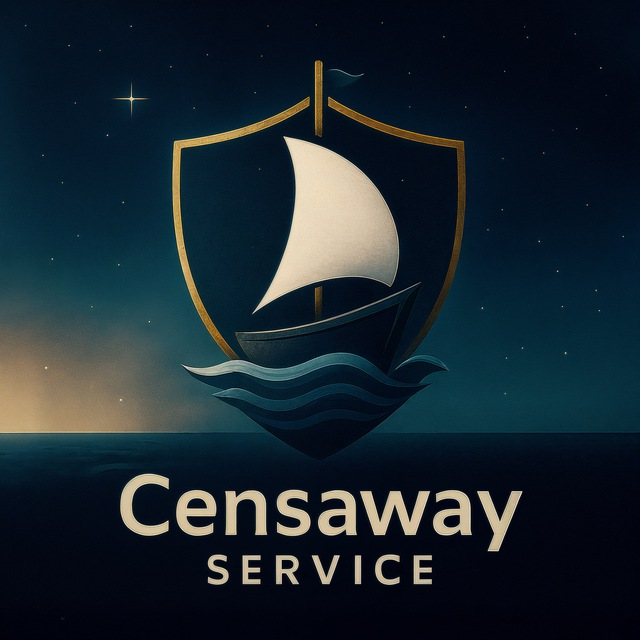

# 🛡️ CensawayApp

<p align="center">
  
</p>

<p align="center">
  <b>Современный, быстрый и красивый VPN-клиент с поддержкой VLESS, Reality и TUN-режима.</b>
</p>

<p align="center">
  
  
  
  
</p>

---

## ✨ Возможности

CensawayApp — это GUI-оболочка для мощного ядра **sing-box**, написанная на Go (Wails) и React. Приложение создано для обхода блокировок с максимальным комфортом.

*   🚀 **Поддержка протоколов:** VLESS (Vision, Reality, TLS, TCP/WS/gRPC/HTTP).
*   🌐 **Режимы работы:**
    *   **TUN Mode:** Виртуальный сетевой интерфейс (маршрутизация всего трафика системы, включая игры и терминал).
    *   **System Proxy:** Автоматическая настройка системного прокси Windows.
*   🧠 **Smart Routing:**
    *   Прямое подключение к российским сайтам (`.ru`, `.rf` и список GeoIP RU) — не замедляет локальный трафик.
    *   Пользовательские правила маршрутизации (домены и IP).
*   📦 **Управление профилями:** Поддержка подписок (Subscriptions) и одиночных VLESS-ссылок.
*   🖥️ **Удобство:**
    *   Сворачивание в системный трей.
    *   Автозапуск при старте системы (сворачивается в трей).
    *   Автоподключение к последнему серверу.
*   📊 **Мониторинг:** Отображение текущей скорости и задержки (ping) до серверов.
*   🎨 **Интерфейс:** Современный Dark Mode дизайн (Glassmorphism).

## 📥 Установка

Перейдите на вкладку [**Releases**](https://github.com/Censaway/CensawayApp/releases) и скачайте последнюю версию для вашей ОС.

### Windows
1. Скачайте `CensawayApp-amd64-installer.exe`.
2. Запустите установщик.
3. Приложение автоматически установит необходимые драйверы (Wintun) при первом запуске в режиме TUN.

### Linux
1. Скачайте бинарный файл `CensawayApp`.
2. Дайте права на выполнение: `chmod +x CensawayApp`.
3. Запустите. Приложение автоматически создаст ярлык в меню приложений.
4. *Примечание:* Для работы требуются `libgtk-3` и `libwebkit2gtk`.

### macOS
1. Скачайте `CensawayApp-mac.dmg`.
2. Перетащите в папку Applications.
3. *Если появляется ошибка безопасности:* Выполните в терминале `xattr -cr /Applications/CensawayApp.app`.

---

## 🛠️ Сборка из исходников

Если вы хотите собрать приложение самостоятельно.

### Требования
*   **Go** 1.21+
*   **Node.js** 18+ (NPM)
*   **Wails CLI:** `go install github.com/wailsapp/wails/v2/cmd/wails@latest`

### Запуск в режиме разработки
```bash
wails dev
```

### Сборка релизной версии

#### Windows (создание установщика)
Требуется установленный **NSIS**.

*На Windows:*
```powershell
wails build -platform windows/amd64 -nsis
```

*На Linux (кросс-компиляция):*
```bash
# Установите mingw-w64 и nsis
sudo apt install mingw-w64 nsis # Debian/Ubuntu
# или
yay -S mingw-w64-gcc nsis # Arch Linux

# Сборка
CC=x86_64-w64-mingw32-gcc \
CXX=x86_64-w64-mingw32-g++ \
CGO_ENABLED=1 \
wails build -platform windows/amd64 -nsis
```

#### Linux
```bash
wails build -platform linux/amd64
```

#### macOS
```bash
wails build -platform darwin/universal
```

---

## 🏗️ Стек технологий

*   **Frontend:** React, TypeScript, TailwindCSS, Vite.
*   **Backend:** Go (Golang).
*   **Framework:** [Wails v2](https://wails.io).
*   **VPN Core:** [sing-box](https://github.com/SagerNet/sing-box) (скачивается и управляется автоматически).
*   **Driver (Windows):** Wintun.

## 📄 Лицензия

Этот проект распространяется под лицензией MIT. Подробнее см. в файле [LICENSE](LICENSE).

---

<p align="center">
  Сделано с ❤️ для свободного интернета.
</p>